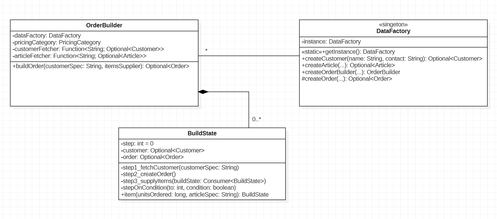

# E1: *Order Table*

[E2: *Code Coverage Analysis*](README_E2.md)

Goal of this assignment is to build *Orders* from *Customers* and *Articles*
using the *Builder Pattern*, to calculate prices and VAT taxes and print
the *Order Table*.

[*Builder*](https://refactoring.guru/design-patterns/builder) is another
*Software Design Pattern* to construct complex objects in multiple-steps.


Steps:

1. [*Builder Pattern* for *Orders*](#1-builder-pattern-for-orders)
1. [Build *Orders*](#2-build-orders)
1. [Calculator methods for *Order* value and VAT tax](#3-calculator-methods-for-order-value-and-vat-tax)
1. [Methods *printOrder()* and *printOrders()*](#4-methods-printorder-and-printorders)
1. [Run Driver Code: *Order* Table](#5-run-driver-code-order-table)
1. [Commit and Push Changes](#6-commit-and-push-changes)


&nbsp;

## 1. *Builder Pattern* for *Orders*

The *Factory* pattern is for simple objects constructed in one step using
*"create()"* methods.
The [*Builder Pattern*](https://en.wikipedia.org/wiki/Builder_pattern) is
used to construct complex objects that require *multiple steps* for creation.
*Builder* uses *"build()"* methods.

The *Builder* maintains interim and partial states of objects
during construction.
In our case, *Orders* are constructed from existing *Customers* and *Articles*.



In the current system, *Customer* and *Article* objects are maintained in
collections: `customers` (list) and `articles` (map indexed by *article.id* ).

```java
/*
 * Collect validated Customer objects in list 'customers'.
 */
final List<Customer> customers = List.of(
    dataFactory.createCustomer("Eric Meyer", "eric98@yahoo.com"), ...
) ...

/*
 * Collect validated Article objects in a map 'articles'.
 */
final Map<String, Article> articles = List.of(
    dataFactory.createArticle("Tasse", 299, PricingCategory.BasePricing), ...
//
) ...
```

The *Customer* object for Eric is stored in list `customers`.
*Articles* are stored in the `articles` map.

```
+----------+-------------------------------------------------+-----------------+
|Bestell-ID| Bestellungen                     MwSt*     Preis|   MwSt    Gesamt|
+----------+-------------------------------------------------+-----------------+
|8592356245| Eric's Bestellung (in EUR):                     |                 |
|          |  - 4x Teller, 4x 6.49            4.14      25.96|                 |
|          |  - 8x Becher, 8x 1.49            1.90      11.92|                 |
|          |  - 1x Buch 'UML'                 5.23*     79.95|                 |
|          |  - 4x Tasse, 4x 2.99             1.91      11.96|  13.18    129.79|
+----------+-------------------------------------------------+-----------------+
```

To build Eric's *Order*, his Customer object must be looked up in `customers`
and the same for ordered articles in `articles`.

This leads to a multi-step process for creating Eric's order:

1. Look up Eric's *Customer* object by Eric's *name* or *id*.

1. If the *Customer* object was found, create an (empty) *Order* object by
    invoking *DataFactory's* `createOrder(Customer customer, ... )` method.

1. If the *Order* object could be created by *DataFactory*, attach ordered
    items to the order.

1. Return the order if it could be created - or an empty Optional.

The *Builder Pattern* is meant to be used for complex multi-step object creation.

Install class [*OrderBuilder.java*](OrderBuilder.java) into the project that
implements the *Builder Pattern* for *Orders*. Main parts are:

- references to collections of *Customers* and *Articles* from which orders
    can be built (note the shift in *Customers* from list to map).

- an inner `class BuildState` to store state while the build process of an
    order is still in progress. The class provides methods for build-steps: 1 - 3
    (see *Builder Pattern*).

- a main `Optional<Order> buildOrder(customerSpec, addItems)` method to
    execute the steps for building an order. The method returns the order
    in an *Optional* or returns an empty *Optional* if order could not be
    built, e.g. because the customer could not be found in the *Customers*
    collection.

    ```java
    /**
     * Class to build {@link Order} objects as a multi-step process.
     */
    public final class OrderBuilder {

        /**
        * Reference to the {@link DataFactory} singleton.
        */
        private final DataFactory dataFactory;

        /**
        * {@link Pricing.PricingCategory} used by {@link OrderBuilder} instance.
        */
        private final PricingCategory pricingCategory;

        /**
        * Function to fetch {@link Customer} object from spec-String matching
        * customer id, first or last name.
        */
        private final Function<String, Optional<Customer>> customerFetcher;

        /**
        * Function to fetch {@link Article} object from spec-String matching
        * article id or description.
        */
        private final Function<String, Optional<Article>> articleFetcher;


        /**
        * Inner class to hold interim state of an partially built {@link Order}
        * object. BuildState is passed during build steps.
        */
        @AllArgsConstructor(access=AccessLevel.PRIVATE)
        public final class BuildState {

            /**
            * Current build step.
            */
            private int step = 0;

            /**
            * Customer looked up from {@link customers} collection.
            */
            private Optional<Customer> customer;

            /**
            * Partially built order.
            */
            private Optional<Order> order;

            /**
            * Private default constructor to avoid javadoc warning: default constructor,
            * which does not provide a comment.
            */
            private BuildState() { }


            /**
            * Create and add {@link OrderItem} to order as part of the final build step.
            * @param unitsOrdered units of an article ordered
            * @param articleSpec specification of an article to look up by articleFetcher
            * @return chainable self-reference
            */
            public BuildState item(long unitsOrdered, String articleSpec) { ... }

            /**
            * Build step 1: fetch customer object from a customer specification (matching if, first or last name).
            * @param customerFetcher supplier of customer object from customer specification (by matching id or name)
            */
            private void step1_fetchCustomer(String customerSpec) {
                if(step==0) {
                    customer = customerFetcher.apply(customerSpec);
                    stepOnCondition(1, customer.isPresent());
                }
            }

            /**
            * Build step 2: create order object.
            */
            private void step2_createOrder() {
                if(step==1) {
                    order = dataFactory.createOrder(pricingCategory, customer);
                    stepOnCondition(2, order.isPresent());
                }
            }

            /**
            * Build step 3: add ordered items.
            * @param buildState passed to add {@link OrderItem} objects to order
            */
            private void step3_supplyItems(Consumer<BuildState> buildState) {
                if(step==2) {
                    buildState.accept(this);
                    stepOnCondition(3, order.get().itemsCount() > 0);
                }
            }

            /**
            * Internal helper method to step build counter if condition is met.
            * @param to next value of step counter
            * @param condition condition that must be met to step counter
            */
            private void stepOnCondition(int to, boolean condition) {
                step = condition? to : step;
            }
        }

        /**
         * Method to build {@link Order} object.
         * @param customerSpec specification matching customer id, first or last name
         * @param buildState call-out to add {@link OrderItem} to order
         * @return fully built {@link Order} object or empty Optional
         */
        public Optional<Order> buildOrder(String customerSpec, Consumer<BuildState> buildState) {
            var bst = new BuildState(0, Optional.empty(), Optional.empty());
            // 
            bst.step1_fetchCustomer(customerSpec);
            bst.step2_createOrder();
            bst.step3_supplyItems(buildState);
            // 
            return bst.order;
        }
    }
    ```

Install class
[*OrderBuilder.java*](OrderBuilder.java)
into the code base.

With class *OrderBuilder*, the signature (method interface) of class
*DataFactory* is extended by method `createOrderBuilder(...)` that
returns a new *OrderBuilder* instance that can be used to build *Order*
objects.

The visibility of method `createOrder(...)` changes from `public` to
`protected` since orders will no longer be created directly, but
through *OrderBuilder*:

```java
/**
 * Create {@link OrderBuilder} object used to build {@link Order} objects.
 * @param pricingCategory pricing category used to build order
 * @param customerFetcher function to fetch {@link Customer} object from spec-String matching customer id, first or last name.
 * @param articleFetcher function to fetch {@link Article} object from spec-String matching article id or description.
 * @return {@link OrderBuilder} object used to build {@link Order} objects
 * @throws IllegalArgumentException thrown by {@link OrderBuilder} constructor if arguments are null
 */
public OrderBuilder createOrderBuilder(
    PricingCategory pricingCategory,
    Function<String, Optional<Customer>> customerFetcher,
    Function<String, Optional<Article>> articleFetcher
) {
    return new OrderBuilder(this, pricingCategory, customerFetcher, articleFetcher);
}

/**
 * Non-public <i>Factory</i> method to create an object of class {@link Order}
 * from validated arguments. The <i>id</i> attribute is internally
 * provided. No object is created when arguments are not valid.
 * Method is used by {@link OrderBuilder} and no longer publicly exposed.
 * @param category pricing category that applies to {@link Order}
 * @param customer owner of the order (foreign-key relaion)
 * @return {@link Order} object created from valid arguments or empty
 */
Optional<Order> createOrder(PricingCategory category, Optional<Customer> customer) {
    if(category==null)
        throw new IllegalArgumentException("argument category: null");
    if(customer==null)
        throw new IllegalArgumentException("argument customer: null");
    //
    if(customer.isPresent()) {
        LocalDateTime created = LocalDateTime.now();
        var order = new Order(orderIdPool.next(), customer.get(), category.pricing(), created);
        return Optional.of(order);
    } else {
        return Optional.empty();
    }
}
```


&nbsp;

## 2. Build *Orders*

Install a new driver class [*Application_E12.java*](Application_E12.java)
in package `application`.

Building *Orders* requires *Customers* and *Articles*. Hence, respective
maps are filled in the default constructor with sample objects.
Read about the use of *Java Stream-API* method:
[*flatMap(...)*](https://www.baeldung.com/java-filter-stream-of-optional)
for filtering a stream of optionals.


```java
package application;

import java.util.*;
import java.util.function.Function;
import java.util.stream.Collectors;
import java.util.stream.IntStream;

import application.Runtime.Bean;
import datamodel.*;
import datamodel.Order.OrderItem;
import datamodel.Pricing.*;
import datamodel.Pricing.Currency;

/**
 * Driver class for the <i>d34-ordertable</i> assignment. Class creates
 * {@link Customer}, {@link Article} and {@link Order} objects and prints
 * tables of objects.
 * <br>
 * Class implements the {@link Runtime.Runnable} interface.
 * 
 * @version <code style=color:green>{@value application.package_info#Version}</code>
 * @author <code style=color:blue>{@value application.package_info#Author}</code>
 */
@Bean(priority=12)
public class Application_E12 implements Runtime.Runnable {

    /**
     * Reference to the {@link DataFactory} singleton.
     */
    private final DataFactory dataFactory = DataFactory.getInstance();

    /**
     * Map of {@link Customer} objects indexed by {@code id}.
     */
    private final Map<Long, Customer> customers = new HashMap<>();

    /**
     * Map of {@link Article} objects indexed by {@code id}.
     */
    private final Map<String, Article> articles = new HashMap<>();

    /**
     * Map of {@link Order} objects indexed by {@code id}.
     */
    private final Map<Long, Order> orders = new HashMap<>();


    /**
     * Method of the {@link Runtime.Runnable} interface called by {@link Runtime}.
     * Program execution starts here.
     * @param properties properties from the {@code application.properties} file
     * @param args arguments passed from the command line
     */
    @Override
    public void run(Properties properties, String[] args) {
        // 
        // create Customer objects and collect in 'customers' map
        List.of(
            dataFactory.createCustomer("Eric Meyer", "eric98@yahoo.com").map(c -> c.addContact("eric98@yahoo.com").addContact("(030) 3945-642298")),
            dataFactory.createCustomer("Anne Bayer", "anne24@yahoo.de").map(c -> c.addContact("(030) 3481-23352").addContact("fax: (030)23451356")),
            dataFactory.createCustomer("Schulz-Mueller, Tim", "tim2346@gmx.de"),
            dataFactory.createCustomer("Blumenfeld, Nadine-Ulla", "+49 152-92454"),
            dataFactory.createCustomer("Khaled Saad Mohamed Abdelalim", "+49 1524-12948210"),
            // 
            // invalid email address and name, no objects are created
            dataFactory.createCustomer("Mandy Mondschein", "locomandy<>gmx.de").map(c -> c.addContact("+49 030-3956256")),
            dataFactory.createCustomer("", "nobody@gmx.de")
        ).stream()
            // .filter(o -> o.isPresent())
            // .map(o -> o.get())
            // .flatMap(o -> o.isPresent() ? Stream.of(o.get()) : Stream.empty())
            .flatMap(Optional::stream)
            .forEach(customer -> customers.put(customer.getId(), customer));
        // 
        // create Article objects and collect in 'articles' map
        List.of(
            dataFactory.createArticle("Tasse",         299, PricingCategory.BasePricing),
            dataFactory.createArticle("Becher",        149, PricingCategory.BasePricing),
            dataFactory.createArticle("Kanne",        1999, PricingCategory.BasePricing),
            dataFactory.createArticle("Teller",        649, PricingCategory.BasePricing),
            dataFactory.createArticle("Buch 'Java'",  4990, PricingCategory.BasePricing, TAXRate.Reduced),
            dataFactory.createArticle("Buch 'UML'",   7995, PricingCategory.BasePricing, TAXRate.Reduced),
            dataFactory.createArticle("Pfanne",       4999, PricingCategory.BasePricing),
            dataFactory.createArticle("Fahrradhelm", 16900, PricingCategory.BasePricing),
            dataFactory.createArticle("Fahrradkarte",  695, PricingCategory.BasePricing, TAXRate.Reduced)
        ).stream()
            .flatMap(Optional::stream)
            .forEach(article -> articles.put(article.getId(), article));
        // 
        // 
        // create OrderBuilder with DataFactory for BasePricing
        final var orderBuilder = dataFactory.createOrderBuilder(
            PricingCategory.BasePricing,
            // 
            // function to look up customer in 'customers' map matching 'id', 'last' or 'first' name
            customerSpec -> findCustomerBySpec(customerSpec),
            // 
            // function to look up article in 'articles' map matching 'id' or 'description'
            articleSpec -> findArticleBySpec(articleSpec));
        // 
        // 
        // build Order objects using OrderBuilder and collect in 'orders' map
        List.of(
            // 
            // Eric's 1st order
            orderBuilder.buildOrder("Eric", buildState -> buildState
                .item( 4, "Teller")         // + item: 4 Teller, 4x 6.49 €
                .item( 8, "Becher")         // + item: 8 Becher, 8x 1.49 €
                .item( 1, "SKU-425378")     // + item: 1 Buch "UML", 1x 79.95 €, 7% MwSt (5.23€)
                .item( 4, "Tasse")          // + item: 4 Tassen, 4x 2.99 €
            )
        ).stream()
            .flatMap(Optional::stream)
            .forEach(order -> orders.put(order.getId(), order));

        // print numbers of objects in collections
        System.out.println(String.format(
            "(%d) Customer objects built.\n" +
            "(%d) Article objects built.\n" +
            "(%d) Order objects built.\n---",
            customers.size(), articles.size(), orders.size()));
    }

    /**
     * Find {@link Customer} object in {@link customers} map by a specification,
     * which is the first match by {@code id} or in the {@code lastName} or
     * in the {@code firstName} attribute (in that order).
     * @param customerSpec specification of a customer by id or by name
     * @return {@link Customer} object or empty Optional
     */
    public Optional<Customer> findCustomerBySpec(String customerSpec) {
        return customerSpec==null? Optional.empty() :
            customers.values().stream()
                .filter(c -> Long.toString(c.getId()).equals(customerSpec) ||
                    c.getLastName().contains(customerSpec) ||
                    c.getFirstName().contains(customerSpec)
                )
                .findAny();
    }

    /**
     * Find {@link Article} object in {@link articles} map by a specification,
     * which is the first match by {@code id} or in the {@code description}
     * attribute (in that order).
     * @param articleSpec specification of an article by id or by description
     * @return {@link Article} object or empty Optional
     */
    public Optional<Article> findArticleBySpec(String articleSpec) {
        var article = Optional.ofNullable(articleSpec != null? articles.get(articleSpec) : null);
        if(article.isEmpty()) {
            article = articles.values().stream()
                .filter(a -> a.getDescription().contains(articleSpec))
                .findAny();
        }
        return article;
    }
}
```

Understand how methods `findCustomerBySpec` and `findArticleBySpec` work
to find customer and article objects in maps `customers` and `articles` by
matching *id*, *name* or *description* attributes.

Consider fragment: `buildState -> buildState.item( 4, "Teller"). ...`
invoked by *OrderBuilder* during order construction to add items.
It is only invoked when the order can be created, e.g. a customer
object was found by matching name *"Eric"*.
Alternatively, *Eric's* `id` can be used (*"892474"* instead of *"Eric"*).

The same applies to article specs that can be provided by description: *"Teller"*
or by id: *"SKU-638035"*.

Running code `Application_E12.java` prints numbers of created objects,
at this stage:

```
(5) Customer objects built.
(9) Article objects built.
(1) Order objects built.            <-- Eric's order
---
```


&nbsp;

## 3. Calculator methods for *Order* value and VAT tax

Printing orders requires methods for price and VAT tax calculations.
Prices are internally calculated as `long` values in *cents* or *1/100* units.

`Double` is used only for calculation, e.g. for percentage rates that are then
rounded into full *1/100* units. Addition or multiplication is performed with
`long` values.

These general accounting rules avoid fractional compounding errors and errors
when comparing values, e.g.: `0.00 != 0.000001`.

Hence, calculation methods return `long` values interpreted as *cents* (EUR)
or *1/100* of a price unit (CHF, GBP).

Add methods to `Application_E12.java`:

```java
/**
 * Calculate a tax included in a gross (<i>"brutto"</i>) value based
 * on a given tax rate.
 * Applies to VAT taxes called <i>"Mehrwertsteuer" (MwSt.)</i> in Germany.
 * @param grossValue value that includes the tax
 * @param taxRate applicable tax rate
 * @return tax included in gross value or 0L if {@code gross value <= 0L}
 */
public long calculateIncludedVAT(long grossValue, double taxRate) {
    return 0L;
}

/**
 * Calculate the value of an {@link OrderItem} as: {@code article.unitPrice *
 * number of units ordered}.
 * @param item to calculate value for
 * @param pricing {@link Pricing} to find article unitPrice
 * @return value of ordered item
 * @throws IllegalArgumentException with null arguments
 */
public long calculateOrderItemValue(OrderItem item, Pricing pricing) {
    return 0L;
}

/**
 * Calculate the VAT included in an order item price uding method:
 * {@code calculateVAT(long grossValue, double taxRate)}.
 * @param item to calculate VAT for
 * @param pricing {@link Pricing} to find VAT tax rate applicable to article
 * @return VAT for ordered item
 * @throws IllegalArgumentException with null arguments
 */
public long calculateOrderItemVAT(OrderItem item, Pricing pricing) {
    return 0L;
}

/**
 * Calculate the total value of an order from the value of each ordered item,
 * calculated with: {@code calculateOrderItemValue(item)}.
 * @param order to calculate value for
 * @return total value of order
 * @throws IllegalArgumentException with null argument
 */
public long calculateOrderValue(Order order) {
    return 0L;
}

/**
 * Calculate the total VAT of an order from compounded VAT
 * of order items calculated with: {@code calculateOrderItemVAT(item)}.
 * @param order to calculate VAT tax for
 * @return VAT calculated for order
 * @throws IllegalArgumentException with null argument
 */
public long calculateOrderVAT(Order order) {
    return 0L;
}
```

Add methods to `Application_E12.java` and implement methods. Start with
the first method: `calculateIncludedVAT(long grossValue, double taxRate)`.

Read about VAT (Value-Added Tax) calculation, *gross* (*"brutto"*) and
*net* (*"netto"*) values see,
[*Umsatz- oder Mehrwertsteuer (MwSt.) Berechnung*](https://www.gruenderlexikon.de/checkliste/fuehren/rechnungen-schreiben/berechnung/).

Explore an [*online calculator*](https://www.blitzrechner.de/mehrwertsteuer-berechnen/)
and calculate VAT values for

1. Given is a *net price* of 100 EUR. What is the VAT at 19%.
    What is the *gross price* the customer has to pay?

1. Given is a *gross price* of 100 EUR that includes VAT at 19%.
    What is the *included VAT*? What is the *net* price?

1. Write down the formula to calculate the included VAT.

Read about the importance of
[*rounding*](https://hilfe.pacemo.de/de-form/articles/3489851-rundungsfehler-bei-rechnungen)
when calculating VAT.

- Define exactly, which parts of your VAT formula must be calculated with
    `double` precision and how the result is rounded in the correct `long` value.

- Implement method: `calculateIncludedVAT(long grossValue, double taxRate)`
    according to your formula.

- Add *price formatting* methods to `Application_E12.java` from
    [*gist*](https://gist.github.com/sgra64/b2bd8e0f15f032d363fc3af04404db88)
     and test VAT calculation:

    ```java
    // gross value of 119 EUR, which includes 19 EUR VAT of a net value of 100 EUR
    long gross = 11900;
    long includedVAT = calculateIncludedVAT(11900, 19.0);
    long net = gross - includedVAT;
    System.out.println(String.format("gross value: %s, including %s VAT; net value: %6s",
        fmtPrice(gross, Pricing.Currency.Euro, 1),
        fmtPrice(includedVAT, Pricing.Currency.Euro),
        fmtPrice(net, Pricing.Currency.Euro)
    ));
    ```

    Repeat for gross value: 100.00 EUR to see the difference:

    ```
    gross value: 119.00 EUR, including 19.00 VAT; net value: 100.00
    gross value: 100.00 EUR, including 15.97 VAT; net value:  84.03
    ```

- Add [*Application_E12_Calculation_Tests.java*](Application_E12_Calculation_Tests.java)
    to tests and run JUnit tests for *calculateIncludedVAT()*.
    Start with test method 100 ommiting the other tests. Add tests as they pass:

    ```sh
    test=application.Application_E12_Calculation_Tests

    java $(eval echo $JUNIT_CLASSPATH) org.junit.platform.console.ConsoleLauncher\
        $(eval echo $JUNIT_OPTIONS) \
        -m ${test}#test_100_calculateIncludedVAT_regular \
        -m ${test}#test_110_calculateIncludedVAT_rounding_tests \
        -m ${test}#test_120_calculateIncludedVAT_corner_cases_tests \
        -m ${test}#test_130_calculateIncludedVAT_bulk_19pct_tests \
        -m ${test}#test_131_calculateIncludedVAT_bulk_7pct_tests
    ```

- With all tests passing:

    ```
    ╷
    ├─ JUnit Jupiter ✔
    │  └─ Application_E12_Calculation_Tests ✔
    │     ├─ test_100_calculateIncludedVAT_regular() ✔
    │     ├─ test_110_calculateIncludedVAT_rounding_tests() ✔
    │     ├─ test_120_calculateIncludedVAT_corner_cases_tests() ✔
    │     ├─ test_130_calculateIncludedVAT_bulk_19pct_tests() ✔
    │     └─ test_131_calculateIncludedVAT_bulk_7pct_tests() ✔
    ├─ JUnit Vintage ✔
    └─ JUnit Platform Suite ✔

    Test run finished after 215 ms
    [         5 tests found           ]
    [         5 tests successful      ]
    [         0 tests failed          ]
    ```

Next, implement method: `long calculateOrderItemValue(OrderItem item, Pricing pricing)`
to calculate the value of an order item.
Recall class *Order* to understand what an *OrderItem* is (an ordered number of
units of an article) and how its value can be calculated.

Run JUnit tests for the method:

```sh
test=application.Application_E12_Calculation_Tests

java $(eval echo $JUNIT_CLASSPATH) org.junit.platform.console.ConsoleLauncher\
    $(eval echo $JUNIT_OPTIONS) \
    -m ${test}#test_200_calculateOrderItemValue_tests \
    -m ${test}#test_210_calculateOrderItemValue_SwissPricing_tests
```

Implement methods: `long calculateOrderItemValue(OrderItem item, Pricing pricing)`
and `long calculateOrderItemVAT(OrderItem item, Pricing pricing)`
to calculate the value and the VAT of an order item.

Recall class *Order* to understand what an *OrderItem* is (an ordered number of
units of an article) and how its value and VAT can be calculated using method `calculateOrderItemValue()`.

Run JUnit tests for these methods:

```sh
test=application.Application_E12_Calculation_Tests

java $(eval echo $JUNIT_CLASSPATH) org.junit.platform.console.ConsoleLauncher\
    $(eval echo $JUNIT_OPTIONS) \
    -m ${test}#test_200_calculateOrderItemValue_tests \
    -m ${test}#test_210_calculateOrderItemValue_SwissPricing_tests \
    -m ${test}#test_300_calculateOrderItemVAT_tests \
    -m ${test}#test_310_calculateOrderItemVAT_SwissPricing_tests
```

Finally, implement methods: `long calculateOrderValue(Order order)`
and `long calculateOrderVAT(Order order)`
to calculate the value and the VAT of an order.

Run JUnit tests for these methods:

```sh
test=application.Application_E12_Calculation_Tests

java $(eval echo $JUNIT_CLASSPATH) org.junit.platform.console.ConsoleLauncher\
    $(eval echo $JUNIT_OPTIONS) \
    -m ${test}#test_400_calculateOrderValue_tests \
    -m ${test}#test_410_calculateOrderValue_SwissPricing_tests \
    -m ${test}#test_500_calculateOrderVAT_tests \
    -m ${test}#test_510_calculateOrderVAT_SwissPricing_tests
```

Run all JUnit tests:

```sh
java $(eval echo $JUNIT_CLASSPATH) org.junit.platform.console.ConsoleLauncher\
    $(eval echo $JUNIT_OPTIONS) \
    -c application.Application_E12_Calculation_Tests
```
```
╷
├─ JUnit Jupiter ✔
│  └─ Application_E12_Calculation_Tests ✔
│     ├─ test_100_calculateIncludedVAT_regular() ✔
│     ├─ test_110_calculateIncludedVAT_rounding_tests() ✔
│     ├─ test_120_calculateIncludedVAT_corner_cases_tests() ✔
│     ├─ test_130_calculateIncludedVAT_bulk_19pct_tests() ✔
│     ├─ test_131_calculateIncludedVAT_bulk_7pct_tests() ✔
│     ├─ test_200_calculateOrderItemValue_tests() ✔
│     ├─ test_210_calculateOrderItemValue_SwissPricing_tests() ✔
│     ├─ test_300_calculateOrderItemVAT_tests() ✔
│     ├─ test_310_calculateOrderItemVAT_SwissPricing_tests() ✔
│     ├─ test_400_calculateOrderValue_tests() ✔
│     ├─ test_410_calculateOrderValue_SwissPricing_tests() ✔
│     ├─ test_500_calculateOrderVAT_tests() ✔
│     └─ test_510_calculateOrderVAT_SwissPricing_tests() ✔
├─ JUnit Vintage ✔
└─ JUnit Platform Suite ✔

Test run finished after 234 ms
[        13 tests found           ]
[        13 tests successful      ]
[         0 tests failed          ]
```


&nbsp;

## 4. Methods *printOrder()* and *printOrders()*

With calculation methods implemented, orders can now be formatted as a table
and printed.

Add missing parts to to *Application_E12.java*:

1. add class
    [*TableFormatter*](https://gist.github.com/sgra64/ba6f543bc4879ee38b2dc0ac9e5834a0) and

1. add methods methods below to *Application_E12.java*:

    - `printOrders(Collection<Order> orders)` and

    - `printOrder(Order order, long orderValue, long orderVAT, TableFormatter tf)`
        to print one single order listing all order items and compounding
        the order value and VAT tax in the right columns.

Method `printOrder(Order order, long orderValue, long orderVAT, TableFormatter tf)`
formats one order objects into a table format returning the result as a *TableFormatter*:

```
+----------+-------------------------------------------------+-----------------+
|8592356245| Eric's Bestellung (in EUR):                     |                 |
|          |  - 4x Teller, 4x 6.49            4.14      25.96|                 |
|          |  - 8x Becher, 8x 1.49            1.90      11.92|                 |
|          |  - 1x Buch 'UML'                 5.23*     79.95|                 |
|          |  - 4x Tasse, 4x 2.99             1.91      11.96|  13.18    129.79|
+----------+-------------------------------------------------+-----------------+
```

Method `printOrders(Collection<Order> orders)` creates a table header and
footer and invokes `printOrder(Order order, ... )` for each order of the `orders`
collection (small `*` indicates reduced VAT tax rate):

```
+----------+-------------------------------------------------+-----------------+
|Bestell-ID| Bestellungen                     MwSt*     Preis|   MwSt    Gesamt|
+----------+-------------------------------------------------+-----------------+
|8592356245| Eric's Bestellung (in EUR):                     |                 |
|          |  - 4x Teller, 4x 6.49            4.14      25.96|                 |
|          |  - 8x Becher, 8x 1.49            1.90      11.92|                 |
|          |  - 1x Buch 'UML'                 5.23*     79.95|                 |
|          |  - 4x Tasse, 4x 2.99             1.91      11.96|  13.18    129.79|
+----------+-------------------------------------------------+-----------------+
                                                      Gesamt:|  13.18    179.79|
                                                             +=================+
```

Add code of both methods to *Application_E12.java*:

```java
/**
 * Print objects of class {@link Order} as table row into a {@link StringBuilder}.
 * @param orders orders to print as row into table
 * @return StringBuilder with orders rendered in table format
 * @throws IllegalArgumentException with null arguments
 */
public StringBuilder printOrders(Collection<Order> orders) {
    if(orders==null)
        throw new IllegalArgumentException("argument orders: null");
    //
    long[] compound = new long[] {0L, 0L};
    //
    var it = orders.iterator();
    var currencyLabel = Optional.ofNullable(it.hasNext()? it.next() : null).map(o -> {
        var cur = o.getPricing().currency();
        return cur==Currency.Euro? "" : String.format(" (in %s)", cur.code());
    }).orElse("");
    // 
    final var tf = new TableFormatter(
            // table column specification
            "|%-10s|", " %-28s", " %8s", "%1s", " %9s", "| %6s", " %9s|"
        )
        .line()     // table header
        .row("Bestell-ID", String.format("Bestellungen%s", currencyLabel), "MwSt", "*", "Preis", "MwSt", "Gesamt")
        .line();
    //
    // print {@link Order} rows:
    orders.stream()
        .forEach(order -> {
            long orderValue = calculateOrderValue(order);
            long orderVAT = calculateOrderVAT(order);
            //
            // print Order as row:
            printOrder(order, orderValue, orderVAT, tf).line();
            //
            // compound order and tax values
            compound[0] += orderValue;
            compound[1] += orderVAT;
        });
    //
    tf.row(null, null, null, null, "Gesamt:", fmtPrice(compound[1], Currency.Euro), fmtPrice(compound[0], Currency.Euro));
    tf.line(null, null, null, null, null, "=", "=");
    return tf.get();
}

/**
 * Print one {@link Order} object as table row into a {@link TableFormatter}.
 * @param order order to print
 * @param orderValue total order value shown in right column
 * @param orderVAT total order tax shown in right column
 * @param tf {@link TableFormatter} to format and store table row
 * @return table formatter with printed row added
 * @throws IllegalArgumentException with null arguments
 */
TableFormatter printOrder(Order order, long orderValue, long orderVAT, TableFormatter tf) {
    if(order==null || tf==null)
        throw new IllegalArgumentException("arguments order or table formatter: null");
    //
    var id = Long.valueOf(order.getId()).toString();
    var pricing = order.getPricing();
    var currency = pricing.currency();
    // limit name length so label 'Bestellung' is not cut off
    var name = String.format("%.11s", order.getCustomer().getFirstName());
    var brief = name.length() > 6;  // shorten labels for longer names
    var curLabel = String.format(brief? "(%s)" : "(in %s)", currency.code());
    var orderLabel = String.format("%s's %s %s:", name, brief? "Best." : "Bestellung", curLabel);
    //
    tf.row(id, orderLabel, "", "", "", "", "");   // heading row with order id and name
    //
    var it = order.getOrderItems().iterator();
    for(int i=0; it.hasNext(); i++) {
        var item = it.next();
        var article = item.article();
        var descr = article.getDescription();
        long unitsOrdered = item.unitsOrdered();
        long unitPrice = pricing.unitPrice(article);
        long value = calculateOrderItemValue(item, pricing);
        long vat = calculateOrderItemVAT(item, pricing);
        var taxRate = pricing.taxRate(article);
        var reducedTaxMarker = taxRate==TAXRate.Reduced? "*" : "";
        String itemDescr = String.format(" - %dx %s%s",
            unitsOrdered, descr, unitsOrdered > 1?
                String.format(", %dx %s", unitsOrdered, fmtPrice(unitPrice, currency)) :
                String.format("")
            );
        String[] totals = i < order.itemsCount() - 1?   // last row?
            new String[] { "", ""} :
            new String[] { fmtPrice(orderVAT, currency), fmtPrice(orderValue, currency) };
        //
        // item rows with item description, VAT, value and totals in the last row
        tf.row("", itemDescr, fmtPrice(vat, currency), reducedTaxMarker, fmtPrice(value, currency), totals[0], totals[1]);
    };
    return tf;
}
```


&nbsp;

## 5. Run Driver Code: *Order* Table

Driver code in `Application_E12.java` prints orders in the same
sequence as they have been created in buildOrders()

```java
/**
 * Map of {@link Order} objects indexed by {@code id}.
 */
private final Map<Long, Order> orders = new HashMap<>();

@Override
public void run(Properties properties, String[] args) {
    // 
    // build orders and collect in 'orders' map
    buildOrders(orders);
    // 
    // print numbers of objects in collections
    System.out.println(String.format(
        "(%d) Customer objects built.\n" +
        "(%d) Article objects built.\n" +
        "(%d) Order objects built.\n---",
        customers.size(), articles.size(), orders.size()));

    // print Order table from values of 'orders' map
    // maintain sequence in which orders were created in DataFactory
    if(orders.size() > 0) {
        // ids as allocated from IdPool<Order> in DataFactory
        var ids = Arrays.asList(
            8592356245L, 3563561357L, 5234968294L, 6135735635L, 6173043537L,
            7372561535L, 4450305661L
        );
        // select orders from 'orders' map in sequence of 'ids'
        var orderList = ids.stream()
            .map(id -> orders.get(id))
            .filter(o -> o != null)     // collect as mutable List
            .collect(Collectors.toCollection(ArrayList::new));
        //
        // add remaining orders
        orderList.addAll(orders.values().stream()
            .filter(o -> ! ids.contains(o.getId()))
            .toList()
        );
        StringBuilder sb3 = printOrders(orderList);
        System.out.println(sb3.insert(0, "Bestellungen:\n").toString());
    }
}
```

At this point, only one order is printed because only one order was created
in *buildOrders()*:

```java
/**
 * Builde sample orders using {@link OrderBuilder}.
 * @param collector map to collect built order objects
 */
private void buildOrders(Map<Long, Order> collector) {
    final var pricing = PricingCategory.BasePricing;
    final OrderBuilder orderBuilder = new OrderBuilder(pricing, customers, articles);
    List.of(
        // 
        // Eric's 1st order using buildOrder() short form
        orderBuilder.buildOrder("Eric", buildState -> buildState
            .item( 4, "Teller")         // + item: 4 Teller, 4x 6.49 €
            .item( 8, "Becher")         // + item: 8 Becher, 8x 1.49 €
            .item( 1, "SKU-425378")     // + item: 1 Buch "UML", 1x 79.95 €, 7% MwSt (5.23€)
            .item( 4, "Tasse")          // + item: 4 Tassen, 4x 2.99 €
        ),
    ).stream()
        .flatMap(Optional::stream)
        .forEach(order -> collector.put(order.getId(), order));
}
```

Complete the code to create the orders shown in the table below.

Run the driver code and print the full order table:

```
(5) Customer objects built.
(9) Article objects built.
(7) Order objects built.
---
Bestellungen:
+----------+-------------------------------------------------+-----------------+
|Bestell-ID| Bestellungen                     MwSt*     Preis|   MwSt    Gesamt|
+----------+-------------------------------------------------+-----------------+
|8592356245| Eric's Bestellung (in EUR):                     |                 |
|          |  - 4x Teller, 4x 6.49            4.14      25.96|                 |
|          |  - 8x Becher, 8x 1.49            1.90      11.92|                 |
|          |  - 1x Buch 'UML'                 5.23*     79.95|                 |
|          |  - 4x Tasse, 4x 2.99             1.91      11.96|  13.18    129.79|
+----------+-------------------------------------------------+-----------------+
|3563561357| Anne's Bestellung (in EUR):                     |                 |
|          |  - 2x Teller, 2x 6.49            2.07      12.98|                 |
|          |  - 2x Tasse, 2x 2.99             0.95       5.98|   3.02     18.96|
+----------+-------------------------------------------------+-----------------+
|5234968294| Eric's Bestellung (in EUR):                     |                 |
|          |  - 1x Kanne                      3.19      19.99|   3.19     19.99|
+----------+-------------------------------------------------+-----------------+
|6135735635| Nadine-Ulla's Best. (EUR):                      |                 |
|          |  - 12x Teller, 12x 6.49         12.43      77.88|                 |
|          |  - 1x Buch 'Java'                3.26*     49.90|                 |
|          |  - 1x Buch 'UML'                 5.23*     79.95|  20.92    207.73|
+----------+-------------------------------------------------+-----------------+
|6173043537| Khaled Saad's Best. (EUR):                      |                 |
|          |  - 1x Buch 'Java'                3.26*     49.90|                 |
|          |  - 1x Fahrradkarte               0.45*      6.95|   3.71     56.85|
+----------+-------------------------------------------------+-----------------+
|7372561535| Eric's Bestellung (in EUR):                     |                 |
|          |  - 1x Fahrradhelm               26.98     169.00|                 |
|          |  - 1x Fahrradkarte               0.45*      6.95|  27.43    175.95|
+----------+-------------------------------------------------+-----------------+
|4450305661| Eric's Bestellung (in EUR):                     |                 |
|          |  - 3x Tasse, 3x 2.99             1.43       8.97|                 |
|          |  - 3x Becher, 3x 1.49            0.71       4.47|                 |
|          |  - 1x Kanne                      3.19      19.99|   5.33     33.43|
+----------+-------------------------------------------------+-----------------+
                                                      Gesamt:|  76.78    642.70|
                                                             +=================+
```

Switch building orders to `SwissPricing` using *CHF* (Swiss Franc) as currency
and Swiss VAT tax rates. The order table now shows prices and taxes in CHF:

```
(5) Customer objects built.
(9) Article objects built.
(7) Order objects built.
---
Bestellungen:
+----------+-------------------------------------------------+-----------------+
|Bestell-ID| Bestellungen (in CHF)            MwSt*     Preis|   MwSt    Gesamt|
+----------+-------------------------------------------------+-----------------+
|8592356245| Eric's Bestellung (in CHF):                     |                 |
|          |  - 4x Teller, 4x 11.69           3.50      46.76|                 |
|          |  - 8x Becher, 8x 2.69            1.61      21.52|                 |
|          |  - 1x Buch 'UML'                 3.65*    143.95|                 |
|          |  - 4x Tasse, 4x 5.39             1.62      21.56|  10.38    233.79|
+----------+-------------------------------------------------+-----------------+
|3563561357| Anne's Bestellung (in CHF):                     |                 |
|          |  - 2x Teller, 2x 11.69           1.75      23.38|                 |
|          |  - 2x Tasse, 2x 5.39             0.81      10.78|   2.56     34.16|
+----------+-------------------------------------------------+-----------------+
|5234968294| Eric's Bestellung (in CHF):                     |                 |
|          |  - 1x Kanne                      2.70      35.99|   2.70     35.99|
+----------+-------------------------------------------------+-----------------+
|6135735635| Nadine-Ulla's Best. (CHF):                      |                 |
|          |  - 12x Teller, 12x 11.69        10.51     140.28|                 |
|          |  - 1x Buch 'Java'                2.28*     89.85|                 |
|          |  - 1x Buch 'UML'                 3.65*    143.95|  16.44    374.08|
+----------+-------------------------------------------------+-----------------+
|6173043537| Khaled Saad's Best. (CHF):                      |                 |
|          |  - 1x Buch 'Java'                2.28*     89.85|                 |
|          |  - 1x Fahrradkarte               0.32*     12.55|   2.60    102.40|
+----------+-------------------------------------------------+-----------------+
|7372561535| Eric's Bestellung (in CHF):                     |                 |
|          |  - 1x Fahrradhelm               22.80     304.25|                 |
|          |  - 1x Fahrradkarte               0.32*     12.55|  23.12    316.80|
+----------+-------------------------------------------------+-----------------+
|4450305661| Eric's Bestellung (in CHF):                     |                 |
|          |  - 3x Tasse, 3x 5.39             1.21      16.17|                 |
|          |  - 3x Becher, 3x 2.69            0.60       8.07|                 |
|          |  - 1x Kanne                      2.70      35.99|   4.51     60.23|
+----------+-------------------------------------------------+-----------------+
                                                      Gesamt:|  62.31  1,157.45|
                                                             +=================+
```

Revert back to `BasePricing`.


&nbsp;

## 6. Commit and Push Changes

Run *JUnit* tests.
With all tests passing, commit and push changes to your *"upstream"*
remote repository.

```sh
git commit -m "e1: order builder and order table"
git push                        # push new commit to your upstream remote repository
```
